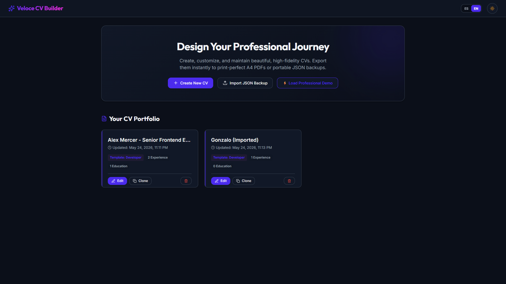
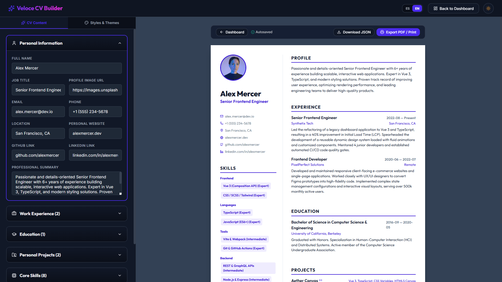

# ⚡ Veloce CV Builder — Premium CV & Portfolio Builder

**Veloce CV Builder** is an interactive, premium, high-fidelity web platform designed to let you build, customize, and maintain professional CV drafts locally, quickly, and visually. Built with **Vue 3**.

The builder delivers a gorgeous split-screen visual playground: edit forms on the left in an elegant, glassmorphic dark theme, and watch the changes render in real-time on the right inside templates mathematically formatted for perfect A4 page print layouts.

---

## 📷 Screenshots

### Dashboard Overview


### Split-Screen Live Builder & Editor


---

## ✨ Key Features

1.  **Dashboard & CV Portfolio**:
    *   Manage multiple CV projects concurrently in your local drafts grid.
    *   Clone/duplicate profiles instantly to customize drafts for different applications.
    *   Import and export full CV configurations as lightweight portable JSON files.
    *   Quick onboarding button **⚡ Load Professional Demo** to populate high-fidelity mock data with a single click.

2.  **Interactive Real-Time Builder**:
    *   Card accordions grouped logically (Personal Info, Experience, Education, Projects, Skills, Custom Sections).
    *   **Up / Down Item Reordering**: Shuffle positions, institutions, projects, skills, or complete sections up/down (`ArrowUp` / `ArrowDown` icons) to adjust chronological alignment seamlessly.
    *   Easily append customized sections (such as *Languages*, *Certifications*, or *Publications*).

3.  **High-Fidelity Styles & Theme Customizer**:
    *   **3 Premium Templates**:
        *   **Modern Developer**: Tech-oriented structure with left sidebar grouped skills, project tags, and clean chronologies.
        *   **Elegant Executive**: Centered Serif layout featuring classic chronological dividing rules and authoritative styling.
        *   **Minimalist Creative**: Colorful asymmetric banner header with distinct columns and artistic accents.
    *   **Dynamic Accent Colors**: Adjust HSL theme variables (Indigo, Emerald, Violet, Amber, Rose, Teal, Blue, Slate) to tint document accents.
    *   **Typography Choices**: Toggle premium Google Fonts including `Outfit` (tech-modern), `Inter` (geometric sans), and `Playfair Display` (elegant serif).
    *   **Density Scaling**: Scale gap dimensions, section margins, item spacing, and header heights in harmony (Compact, Balanced, Relaxed) to fit optimal quantities of content per page.

4.  **Print-to-PDF Layout Engine**:
    *   Optimized `@media print` rules automatically stripping builder headers, sidebars, toolbars, and action buttons on print execution.
    *   Cleans browser-inserted date stamps, page counts, or address links via advanced `@page` margins configuration.
    *   Prevents ugly item splits across printed A4 boundaries (`page-break-inside: avoid`).
    *   **Visual A4 Guidelines**: Enable a subtle dashed boundary line on the editor preview pane to verify if your content perfectly fits on a single sheet before printing.

5.  **Local-First Privacy**:
    *   Your professional data never leaves your computer.
    *   **Autosave**: Every input change syncs reactively and instantly to browser `localStorage`.

---

## 🛠️ Tech Stack & Setup

*   **Core**: Vue 3 (Composition API with `<script setup>`)
*   **Language**: TypeScript
*   **Package Manager**: Bun
*   **Build Tool**: Vite
*   **Styling**: Modern Vanilla CSS with HSL properties and `@media print`
*   **Iconography**: Lucide Icons via `lucide-vue-next`

---

## 📂 Codebase Architecture

```text
src/
├── assets/
│   └── style.css          # Global design system, variables, layouts, & print engines
├── components/
│   ├── CvDashboard.vue    # Landing and portfolio management dashboard
│   ├── CvEditor.vue       # Accordion-based form inputs and reorder guidelines
│   └── CvPreview.vue      # Dynamic template container and print frame
├── types.ts               # Rigid TypeScript interfaces for CV schema
├── mockData.ts            # Prefilled Senior Frontend Engineer profile mock data
├── utils.ts               # Normalization, schema fallback, clone, export & date formatting helpers
├── main.ts                # Application entrypoint importing assets
└── App.vue                # Root orchestrator, local storage sync, & language states
```

---

## 🚀 Installation & Local Development

To run the project locally, make sure you have **Bun** installed.

### 1. Install Project Dependencies

Make sure to install using `bun`:

```bash
bun install
```

### 2. Launch Local Dev Server

Start the local server with instant hot module reloading:

```bash
bun dev
```

Open your browser and navigate to [http://localhost:5173/](http://localhost:5173/).

### 3. Build & Typecheck for Production

Verify TypeScript compilation safety and build the optimized distribution bundle:

```bash
bun run build
```

---

## 📑 Print-to-PDF Operations Manual

Follow these quick steps to get a flawless, professional PDF printout:
1. Open your CV inside the editor.
2. If your content is close to spilling onto page two, adjust spacing density to **Compact** or **Balanced** to shrink dimensions.
3. Click the **Export PDF / Print** button on the preview toolbar.
4. Inside your system print dialog:
   * **Destination**: Set to *Save as PDF*.
   * **Margins**: Set to *None* (highly recommended, as our `@page` print stylesheet handles layout margins).
   * **Background Graphics**: **Check this option** (Enabled) to preserve HSL accent color fills, badges, and separator styles.

---

## 📄 License

This project is licensed under the MIT License. You are free to modify, customize, and publish it as part of your own personal portfolio.
